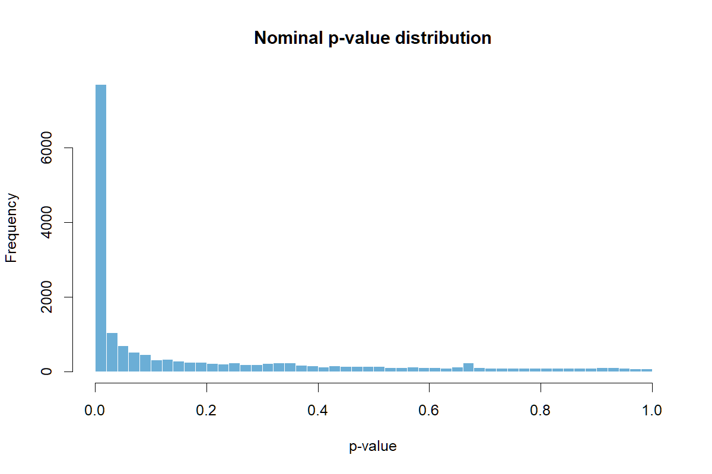
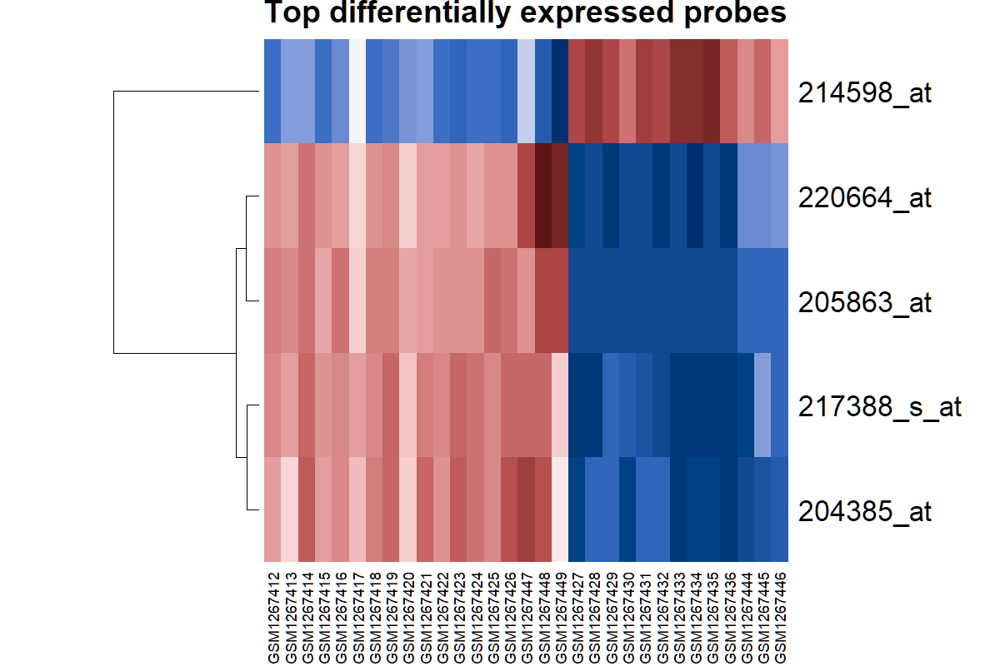

# GEO Psoriasis Expression Analysis

This repository contains a compact R pipeline for differential expression and correlation-shift analysis using the public GEO dataset `GSE52471`. The project was originally developed as an academic analysis by Burak Keskin and has been reorganized as a professional portfolio repository.

The analysis code is not AI-generated; Codex was used only to help curate the repository structure and improve documentation wording.

## Data Source

- GEO accession: `GSE52471`
- Data are loaded programmatically with `GEOquery::getGEO("GSE52471", AnnotGPL = TRUE)`.
- `data/GSE52471_top_table_reference.tsv` is a GEO2R-style reference table used for comparison with the pipeline's BH-significant gene list.

## Methods

- Download and parse the GEO expression set with `GEOquery`.
- Identify psoriasis and normal samples from phenotype titles.
- Run per-probe two-sample t-tests between psoriasis and normal groups.
- Apply Benjamini-Hochberg and Bonferroni multiple-testing correction.
- Compare BH-significant genes against the included GEO2R reference table.
- Repeat the differential-expression test after log2 transformation.
- Test pairwise Pearson and Spearman correlation shifts among the top-ranked probes.
- Export reproducible tables and diagnostic plots.

## Repository Structure

```text
geo_psoriasis_expression_analysis_hw3/
  README.md
  src/
    run_psoriasis_expression_analysis.R
  data/
    GSE52471_top_table_reference.tsv
  results/
    tables/
    plots/
  reports/
    original_analysis_report.pdf
    original_analysis_report_source.docx
```

## Expected Outputs

Running the pipeline creates:

- `results/tables/differential_expression_raw_scale.csv`
- `results/tables/differential_expression_log2_scale.csv`
- `results/tables/bh_significant_genes_raw_scale.txt`
- `results/tables/bh_significant_genes_log2_scale.txt`
- `results/tables/shared_significant_genes_with_geo2r.txt`
- `results/tables/top_gene_correlation_shift_tests.csv`
- `results/tables/analysis_summary.csv`
- `results/plots/pvalue_distribution_raw_scale.png`
- `results/plots/top_gene_expression_heatmap.png`

The large full differential-expression tables are treated as reproducible generated outputs and are excluded from version control. Compact summary outputs, significant-gene lists, correlation-shift tests, and plots are kept in the repository for portfolio review.

## Result Preview

Summary statistics from the current run:

| Dataset | Probes | Psoriasis samples | Normal samples | BH-significant probes, raw scale | BH-significant probes, log2 scale |
| --- | ---: | ---: | ---: | ---: | ---: |
| GSE52471 | 17,440 | 18 | 13 | 5,660 | 5,621 |

P-value distribution:



Top probe expression heatmap:



## Usage

Install the required R/Bioconductor packages:

```r
install.packages("BiocManager")
BiocManager::install(c("GEOquery", "Biobase"))
```

Run the analysis from the repository root:

```bash
Rscript src/run_psoriasis_expression_analysis.R
```

## Limitations

This is a focused expression-analysis exercise, not a complete clinical biomarker-discovery workflow. The correlation-shift screen is exploratory and should be interpreted as hypothesis-generating unless validated with independent cohorts and a more complete model design.
